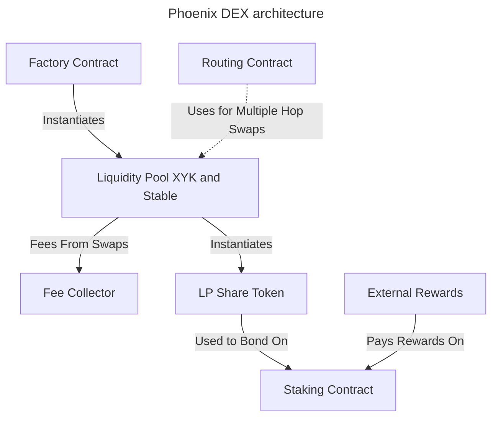
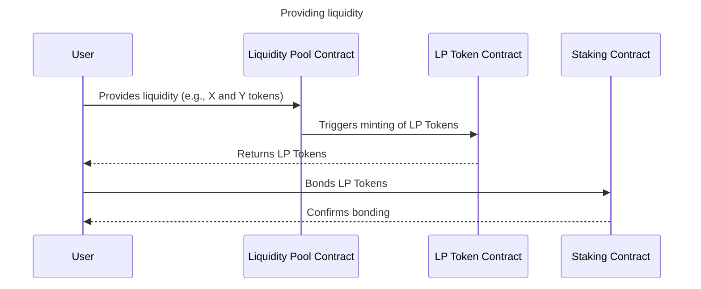
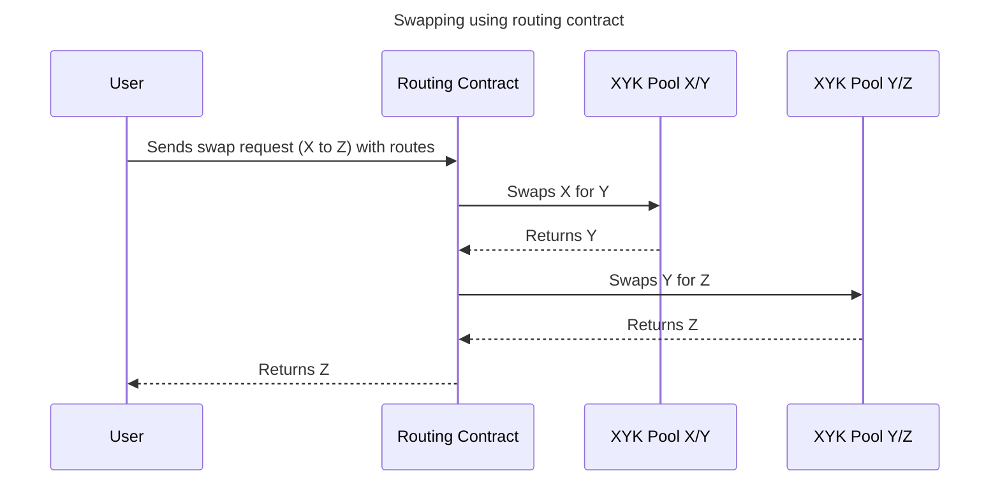
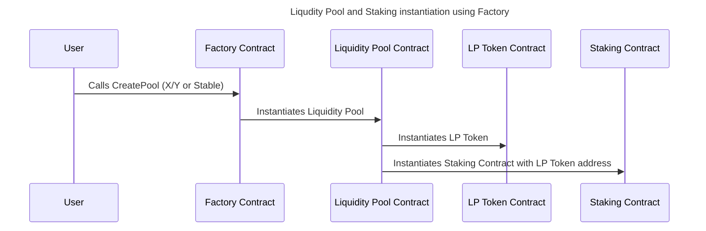

# Phoenix DEX Smart Contracts Design Document

This design document outlines the structure and primary functions of the Automated Market Maker (AMM) smart contracts. The AMM consists of the following contracts: `Pool`, `StablePool`, `StakingContract`, and `Factory`. Each contract serves a specific purpose within the Phoenix project.

## Pool / Stable pool Contract

The `Pool` contract represents a trading pool in the AMM. It allows users to swap between two different tokens. The primary functions of the `Pool` contract are as follows:

1. **Swap**: The `swap` function enables users to exchange one token for another within the trading pool. This function calculates the exchange rate based on the current token balances and reserves.

2. **Add Liquidity**: The `add_liquidity` function allows users to provide liquidity to the trading pool by depositing both tokens in proportion to the existing reserves. This function calculates the number of LP (Liquidity Provider) tokens to mint and assigns them to the liquidity provider.

3. **Remove Liquidity**: The `remove_liquidity` function enables liquidity providers to withdraw their deposited tokens from the trading pool. It burns the corresponding LP tokens and redistributes the proportional amounts of the tokens to the liquidity provider.

## Staking Contract

The `StakingContract` allows users to stake their LP tokens from either the `Pool` or `StablePool` contracts to earn additional rewards. The primary functions of the `StakingContract` are as follows:

1. **Stake**: The `stake` function allows users to stake their LP tokens into the contract to start earning rewards. The contract keeps track of the staked LP tokens and the associated staker. Staking should happen automatically during providing liquidity. Each day user keeps the liqudity, rewards increase 0.5% up to 30% (60 days).

2. **Unstake**: The `unstake` function enables stakers to withdraw their staked LP tokens from the contract. It also distributes the earned rewards to the staker based on their contribution and the total reward pool.

## Routing Contract

The `Routing` contract serves as an intermediary that aids in executing complex trading routes across multiple liquidity pools. This contract significantly simplifies the token swapping process and enhances trading efficiency for users.

## Factory Contract

The `Factory` contract serves as the main contract responsible for deploying new instances of the `Pool` and `StablePool` contracts. Its primary functions are as follows:

1. **Create Pool**: The `create_pool` function allows the factory contract owner to create a new instance of the `Pool`/`StablePool` contract with the specified token pool. It deploys the new contract and emits an event with the contract address.

2. **DeregisterPool**: The `deregister_pool` function allows the factory contract owner to remove given pool from the collection of contracts. It disables swapping and providing liqudity on given pool.

By using these contracts together, users can trade tokens, provide liquidity to the AMM, stake LP tokens and earn rewards within the PHOENIX ecosystem.

Please note that this design document provides a high-level overview of the contracts and their primary functions. The actual implementation may require additional functions, modifiers, and security considerations to ensure the contracts' robustness and reliability.
