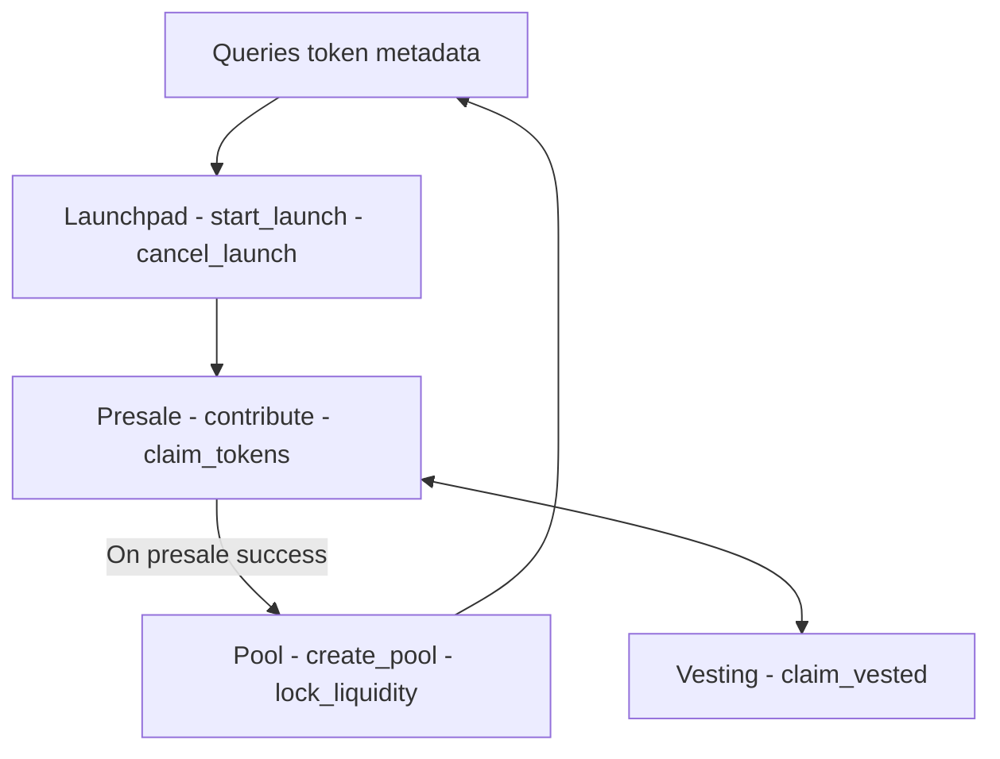

# Launchpad Architecture

This document is a draft for the architecture of a Phoenix launchpad similar to **pump.fun**.

---

## Table of Contents

1. [Overview](#overview)
2. [Core Components](#core-components)
   - [Token Factory Contract](#token-factory-contract)
   - [Launchpad Contract](#launchpad-contract)
   - [Presale Contract - optional](#presale-contract)
   - [Pool Contract](#pool-contract)
   - [Vesting Contract - optional](#vesting-contract)
3. [Smart Contract Interactions](#smart-contract-interactions)

---

## Overview

The goal of this launchpad is to provide an easy experience for the phoenix users to create, launch, and manage tokens on the **Stellar**. The system will consist of multiple smart contracts (probably reusing what we already have) that interact with each other to facilitate token creation, presale, and distribution.

Some key features

- **Token Creation**: Users can create new tokens with input parameters.
- **Presale Mgmt**: Tokens can be distributed through a presale mechanism.
- **Vesting Schedules**: Tokens can be locked and released over time.
- **Governance**: Maybe for community-driven decisions.

---

## Core Components

### Token Factory Contract

The **Token Factory Contract** is responsible for creating new tokens. It allows users to define token parameters such as name, symbol, total supply, and decimals.

#### Key Functions:

- `create_token(name: String, wymbol: String, total_supply: u64, decimals: u8) -> Address`
  - Creates a new token contract and returns its address.
- `get_token(address: Address) -> TokenMetadata`
  - Retrieves metadata about a token (name, symbol, total supply, etc.).

---

### Launchpad Contract

The **Launchpad Contract** acts as the central place for managing the token launches. It interacts with the **Token Factory Contract** to create tokens and the **Presale Contract** to manage token distribution. After a successful presale, the Presale Contract automatically triggers the Pool Contract to create a liquidity pool, allocate a percentage of raised funds and tokens to the pool and lock liquidity for the specified duration.

#### Key Functions:

- `start_launch(token_address: Address, presale_config: PresaleConfig)`
  - Initiates a token launch by creating a presale instance.
- `cancel_launch(token_address: Address)`
  - Cancels an ongoing token launch if the creator has the authority.
- `get_launch_status(token_address: Address) -> LaunchStatus`
  - Returns the status of a token launch (e.g., pending, active, completed).

```Rust
struct PresaleConfig {
    // price per token during the presale in $PHO
    price_per_token: u64,
    // minimum amount a user can contribute to the presale
    min_contribution: u64,
    // maximum amount a single user can contribute to the presale
    max_contribution: u64,
    // minimum funds required for the presale to succeed
    soft_cap: u64,
    // maximum funds that can be raised
    hard_cap: u64,
    // start time of the presale (Unix timestamp )
    start_time: u64,
    // end time of the presale (Unix timestamp)
    end_time: u64,
    // if the presale allows whitelisted users only.
    is_whitelisted: bool, // or `maybe is_invite_only: bool`
    // address of the wallet where the raised funds will be sent after the presale ends.
    funding_wallet: Address,
    // vesting schedule configuration (optional) for tokens claimed post-presale.
    vesting_schedule: Option<VestingScheduleConfig>,
    // if contributors can claim tokens immediately after the presale ends.
    instant_claim_allowed: bool,
    // percentage of presale funds allocated to liquidity (e.g., 70%)
    liquidity_allocation: u64,
    // duration to lock liquidity (Unix timestamp)
    liquidity_lock_duration: u64,
}
```

---

### Presale Contract

The **Presale Contract** manages the distribution of tokens during the presale phase. It handles contributions from degens and ensures that tokens are distributed fairly based on the presale configuration.

#### Key Functions:

- `contribute(token_address: Address, amount: u64)`
  - Allows users to buy tokens from the presale.
- `claim_tokens(token_address: Address)`
  - Allows users to claim their tokens after the presale ends.
- `withdraw_funds(token_address: Address)`
  - Allows the token creator to withdraw funds raised during the presale if allowed

---

### Pool Contract

Reusing the pool xyk pool contract to swap ../$PHO tokens Very light modifications needed

---

### Vesting Contract

The **Vesting Contract** ensures that tokens are released over time.

#### Key Functions:

- `create_vesting_schedule(token_address: Address, beneficiary: Address, start_time: u64, duration: u64, amount: u64)`
  - Creates a vesting schedule for a specific beneficiary.
- `claim_vested_tokens(token_address: Address)`
  - Allows beneficiaries to claim vested tokens.
- `get_vesting_schedule(token_address: Address, rcpt: Address) -> VestingSchedule`
  - Returns the vesting schedule for a specific beneficiary.

---

## Smart Contract Interactions

The following diagram illustrates how the smart contracts interact with each other:


